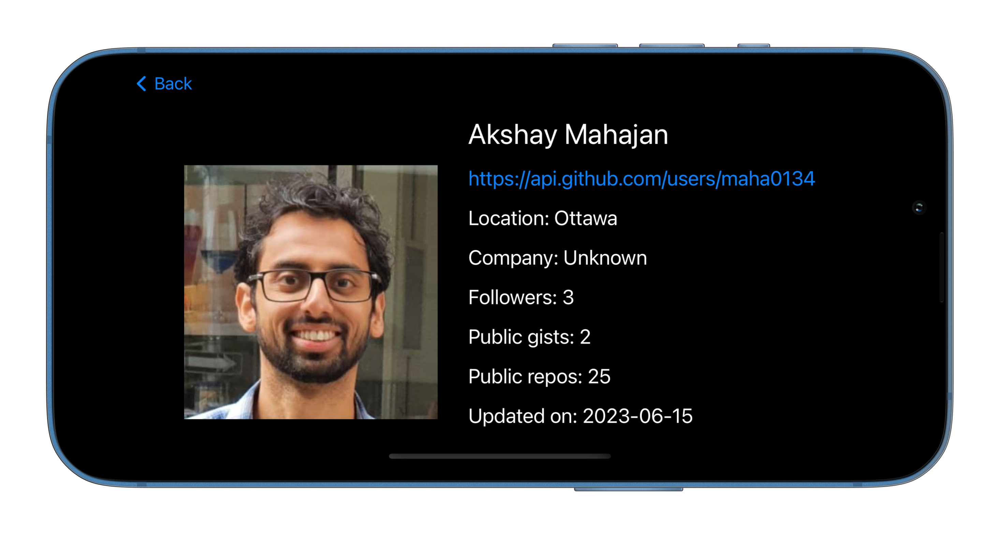
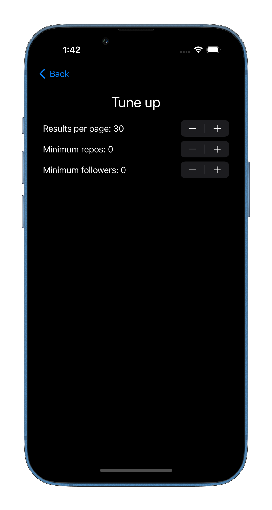

# iOS Git Searcher

## Description
The iOS Git Searcher is a SwiftUI-based app designed to search for profiles on GitHub. Leveraging the latest features of SwiftUI, the app provides a user-friendly interface for querying GitHub profiles. By utilizing Alamofire, it performs fetches and retrieves results based on query parameters that can be easily customized by the user.

## Features
- Swift UI: The app is built using SwiftUI, a modern framework that enables developers to create expressive and dynamic user interfaces.
- GitHub Profile Search: Users can search for profiles on GitHub by entering specific query parameters.
- Fetching with Alamofire: Alamofire, a popular networking library, is employed to handle fetch requests, ensuring efficient data retrieval.
- Customizable Query Parameters: Users have the flexibility to modify query parameters according to their preferences.
- Light and Dark Mode Support: The app seamlessly adapts to both light and dark modes, providing a visually consistent experience.
- Orientations and Tablet support: The user interface adjusts gracefully to different device orientations, enhancing usability and the code is optimized to update the UI for use on Tablets.

## Screenshots

1. Home Screen

2. Search Results

4. Profile Details

5. Settings Page

## Installation
To install the iOS Git Searcher app, follow these steps:

1. Clone the repository: `git clone https://github.com/maha0134/ios-git-searcher.git`
2. Open the project in Xcode.
3. Build and run the app on a simulator or a physical device running **iOS 16.0** or above.
4. Explore the various features and enjoy searching GitHub profiles effortlessly.

## Dependencies
The following dependencies are used in the iOS Git Searcher app:

- Alamofire: A popular Swift networking library for handling fetch requests efficiently.
- ToastSwiftUI: A SwiftUI package for displaying toast notifications.

## Contributing
Contributions are welcome! If you find any issues or have suggestions for improvements, please feel free to open an issue or submit a pull request. Your feedback is valuable in making the iOS Git Searcher app even better.

## Acknowledgments
- The developers and contributors of SwiftUI, Alamofire, ToastSwiftUI and other open-source libraries used in this project.
- The GitHub community for providing a platform with extensive user profiles and repositories.
- My professors for the idea as well as the approach
